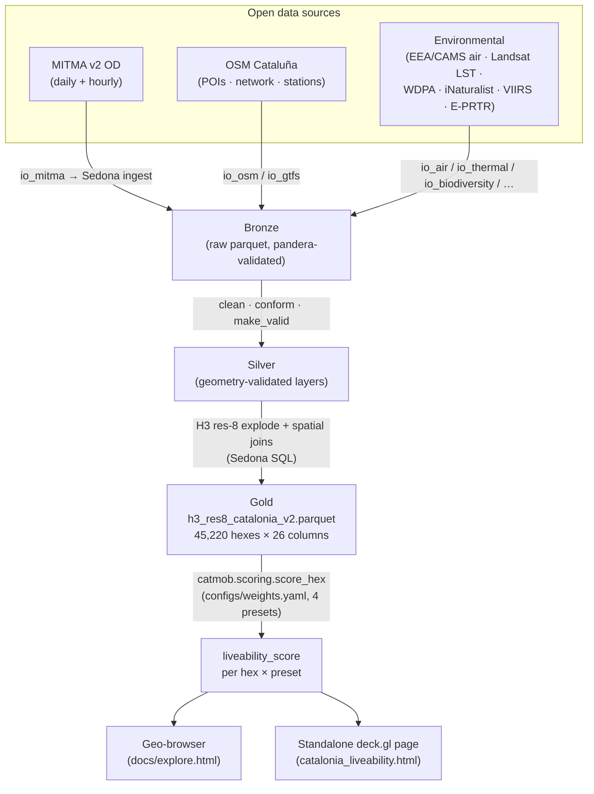

# mitma-sedona

[](docs/quickstart.md#tests)
[](#)
[](#)
[](#)
[](LICENSE)

[](docs/explore.html)

> **Where in Catalonia could I live well?** Within bike-reach of a train station that connects to Barcelona, with climbing gyms and yoga nearby, close to green or sea, away from heavy industry and motorway noise — and breathing clean air, away from urban heat and light pollution, near biodiversity, with health amenities at hand.

A multi-criteria **liveability index over Catalonia**, computed at H3 res-8
(~0.7 km² hexes) with **Apache Sedona on Spark** for the spatial-join heavy
lifting. A real personal question, answered with real data engineering — and a
portfolio piece that shows the operational shape of a geospatial scoring
pipeline under open-data constraints.

> **▶ [Explore the interactive geo-browser →](https://lunasilvestre.github.io/mitma-sedona/explore.html)** — a
> satellite-backed map of the liveability index: 45,220 H3 res-8 hexes over
> keyless Esri World Imagery, with a preset selector, **30+ toggleable analytic
> metrics** (the liveability output, the deep-Spark MITMA mobility/rhythm/typology
> layers, and every scoring input), satellite + dark/light/OSM basemaps, a
> hex-opacity slider, a study panel, an embedded Mermaid pipeline, MITMA OD arcs
> + OSM amenity inputs, and a **Month-window dropdown** (Pooled / winter·Feb /
> spring·May / summer-onset·Jun 2025) that re-points the season-aware mobility
> metrics — plus a dedicated **summer−winter weekend-pull delta** field. Pure
> static (deck.gl + MapLibre + h3-js, zero build step), served from GitHub Pages.
> Source: [`docs/explore.html`](docs/explore.html) +
> [`docs/app/geobrowser-map.js`](docs/app/geobrowser-map.js).

> **Status — shipped & corrected (v2.3, 2026-06).** A full end-to-end index,
> [**live on GitHub Pages**](https://lunasilvestre.github.io/mitma-sedona/explore.html).
> The Sedona/Spark pipeline runs on **real Catalonia data** (7-day dev window,
> 2024-03-04..10) and emits `data/gold/h3_res8_catalonia_v2.parquet` (45,220
> hexes × 26 columns) plus the geo-browser. **Every dimension is now wired to
> real data** — GTFS train frequency, amenities, nature, environmental health,
> and penalties all carry signal (coverage varies by layer). The v1 scoring
> flaw is fixed: amenity proximity is now a **saturating positive closeness
> reward**, not a distance penalty, and all distances are computed in
> **EPSG:25831 metres** (the old degree-buffer distortion is gone). Honest
> caveats that still hold: this is **7 days of March 2024**, liveability is a
> *relative index* (not a guarantee), and some amenity layers are sparse. Only
> optional Valhalla bike isochrones remain. The full before/after record:
> [`docs/v2_revision.md`](docs/v2_revision.md).

> **Deep-Spark/Sedona mobility layers + a month/season dimension (additive).**
> Beyond the published score, a real distributed Sedona pipeline now builds the
> MITMA mobility layers (24-hour rhythm, weekend hotspots, KMeans typology,
> geodemographics, OD arcs) at **full scale — a 390 M-row OD scan over 89 days of
> 2025** — attributed to hexes by an **area-weighted dasymetric crosswalk**
> (`ST_Intersection` in EPSG:25831, closure exactly 1.0000), replacing the
> centroid join that stamped a whole distrito's flow onto every hex. The 89 days
> split into **three calendar month-windows** (winter·Feb / spring·May /
> summer-onset·Jun), each independently re-aggregated, exposed through the
> geo-browser's **Month-window selector** and a **summer−winter weekend-pull
> delta** (`weekend_hotspot_summer_minus_winter`, Jun−Feb: min −0.381 · median
> +0.036 · max +0.589, **75% of hexes positive** — real signal). **Honesty
> contract:** these are three calendar month-windows, a *month-window comparison,
> not a seasonal/climate average* — one cold month is not "winter climatology",
> and the whole thing is a relative index, a starting question, not a guarantee.
> **The default published liveability score is unchanged** — the new mobility +
> season columns ship at weight 0. Full method + numbers:
> [`docs/why_spark_sedona.md`](docs/why_spark_sedona.md).

## Why this exists

National "best places to live" rankings are coarse, opinion-weighted, and
city-level. This project answers a *personal* question at hex granularity:
**where could I, specifically, live well in Catalonia** — trading off mobility
to Barcelona, lifestyle amenities, nature, environmental health, and
penalties (industry, motorway noise, urban heat) — with every dimension sourced
from open data and every weight legible in five lines of YAML. The point is
auditability and honesty about coverage, not a glossy verdict.

## Pipeline



Bronze → Silver → Gold lakehouse, H3 res-8 as the analytical grain, Sedona for
every spatial join. Detail: [`docs/architecture.md`](docs/architecture.md) ·
[`docs/sedona_sql_patterns.md`](docs/sedona_sql_patterns.md).

## The liveability score

A per-hex weighted sum over 26 feature columns across **6 dimensions**, computed
at H3 res-8. It is a **relative index** — a starting question, not a guarantee.
NULL features (sparse coverage) are kept as a distinct *"none within reach"*
state, never silently rendered as 0. Amenity terms (climb / yoga / hospital /
green) are **saturating positive closeness rewards** — full bonus on the
doorstep, decaying to 0 at the 10 km catchment edge — so presence always beats
absence and near beats far. Every distance is computed in **EPSG:25831 metres**.

| Dimension | Sources | Status |
|---|---|:--:|
| Mobility & accessibility | Train reach from stations, **Renfe Rodalies + FGC GTFS frequency** (`trains_per_day_nearest`, `trains_to_bcn_nearest`) | **LIVE** · optional Valhalla isochrones would refine reach |
| Lifestyle | OSM `sport=climbing`, `sport=yoga` (closeness reward) | **LIVE** |
| Mobility "vibe" | MITMA daily OD inflow / outflow, through-flow ratio | **LIVE** |
| Penalties | OSM `landuse=industrial`, **E-PRTR registry** (nearest-facility), motorway proximity | **LIVE** |
| Health amenities | OSM hospitals ∪ CatSalut registry, OSM pharmacy density | **LIVE** |
| Nature | OSM parks / coastline, **Copernicus tree cover**, **Natura 2000** (land-clipped), **GBIF/iNaturalist** biodiversity | **LIVE** |
| Environmental health | **XVPCA NO₂/PM₂.₅** (WHO-2021 thresholds), **Landsat LST urban-heat Δ**, **VIIRS light pollution** | **LIVE** |

Default weights are balanced across the six dimensions; three presets re-weight
them — **`nature_first`** (green/sea + biodiversity), **`quiet_strict`**
(harder noise/industry penalty), **`amenity_first`** (health + lifestyle). The
scoring function is `catmob.scoring.score_hex`, driven by
[`configs/weights.yaml`](configs/weights.yaml). Full methodology:
[`docs/scoring.md`](docs/scoring.md).

## Data sources

All open, all citable. Condensed table below; full catalog + licences in
[`docs/data_sources.md`](docs/data_sources.md) and
[`data/README.md`](data/README.md).

| Source | What | Licence |
|---|---|---|
| MITMA v2 OD distritos (daily + hourly) | mobility flows | MITMA Open Data ≈ CC BY 4.0 |
| OSM Cataluña PBF | POIs + network + boundaries | ODbL |
| Renfe Rodalies + FGC GTFS | train frequencies | open |
| EEA + XVPCA + Copernicus CAMS | air quality | CC BY 2.5 / 4.0 / Copernicus |
| Landsat 8/9 LST (MS Planetary Computer STAC) | urban heat island | open |
| WDPA / Natura 2000 + Copernicus TCD + iNaturalist (GBIF) | biodiversity | CC BY 4.0 / CC BY-NC |
| E-PRTR + VIIRS DNB | non-air pollution | CC BY 2.5 / open |
| CatSalut hospital registry | health amenities | CC BY 4.0 |

**Default data window:** Q1+Q2 2024 daily MITMA + all March 2024 hourly MITMA
(~3.5 GB bronze). `--scope dev` uses the 7-day window (2024-03-04..10) the
shipped v2.3 score was built on. The additive **deep-Spark mobility/season
layers** use a separate **89-day 2025 window** — three calendar month-windows,
Feb (28d) + May (31d) + Jun (30d), a 390 M-row OD scan — for the month/season
comparison (see [`docs/why_spark_sedona.md`](docs/why_spark_sedona.md)).

## Stack & architecture

| Concern | Choice | Why |
|---|---|---|
| Spatial joins at scale | **Apache Sedona 1.9 on Spark 4.1** | 390 M-row MITMA OD aggregation (89 days, 2025) + dasymetric H3 crosswalk in SQL |
| Analytical grain | **H3 res-8** (~0.7 km² hexes) | uniform, hierarchical, join-friendly |
| Lakehouse | **Bronze → Silver → Gold** parquet, pandera contracts on write | provenance + validation |
| Library | `src/catmob/` (schemas, io, scoring, viz) | reusable, testable, notebook-agnostic |
| Visualisation | **deck.gl 9.3 + MapLibre GL 4.7 + h3-js**, keyless, zero build | static GitHub Pages, no backend |

Sedona handles every spatial join. The deep-Spark mobility/season layers run the
**390 M-row MITMA OD aggregation + the dasymetric H3 crosswalk** on real Sedona
(the crosswalk's `BroadcastIndexJoin` R-tree is now proven on this env — a
classloader collision on the spatial-index serde was diagnosed and fixed; see
[`docs/why_spark_sedona.md`](docs/why_spark_sedona.md)). Repo layout +
lakehouse design: [`docs/architecture.md`](docs/architecture.md). The eight SQL
idioms used (H3 cell-id explode, dasymetric disaggregation, `RS_ZonalStats`,
`ST_KNN`, `BROADCAST` hints, GeoArrow zero-copy, `MAX_BY` peak-hour, `ST_DBSCAN`):
[`docs/sedona_sql_patterns.md`](docs/sedona_sql_patterns.md).

## Results (v2.3)

The corrected end-to-end run on real Catalonia data (7-day dev window) produced:

- **`data/gold/h3_res8_catalonia_v2.parquet`** — **45,220 hexes × 26 columns**, every dimension wired to real data.
- 27.7 M MITMA OD rows ingested, plus real GTFS frequency (Renfe Rodalies + FGC), OSM amenities, Copernicus tree cover, Natura 2000, GBIF biodiversity, XVPCA air, Landsat LST, VIIRS, and E-PRTR.
- Default-preset score distribution: min 7.9 · median 59.3 · mean 57.1 · max 100.0 · stdev 14.3.

**What the fix changed.** With amenity proximity reformulated as a saturating
**positive** closeness reward (and all distances in EPSG:25831 metres), the
index now discriminates properly: the top-scoring hexes are **Barcelona core
and the well-served coast**, not the empty inland Girona / Lleida towns that v1
wrongly ranked at the top (they scored high only because their penalties didn't
apply *and* their amenity distances were NULL). Reus, for example, now scores
≈ 51.5 (default), up from v1's 21.6.

**Honest caveats that still hold.** This is **7 days of March 2024**, the score
is a **relative index, not a guarantee**, and some amenity layers are sparse
(e.g. yoga ~15 %, sea ~6 % coverage). Only optional Valhalla bike isochrones
would further refine the train-reach term. Full numbers, the top-10 table, and
the retrospective: [`docs/results.md`](docs/results.md).

## Repository layout

```
mitma-sedona/
├── README.md                       # this file
├── PLAN.md                         # canonical planning doc + milestones
├── configs/weights.yaml            # liveability scoring weights (4 presets)
├── src/catmob/                     # reusable library
│   ├── schemas.py                  # pandera contracts (GOLD_HEX_SCHEMA, …)
│   ├── io_*.py                     # source readers (mitma, osm, gtfs, air, thermal, …)
│   ├── scoring.py                  # score_hex + score_dataframe
│   └── viz.py                      # deck.gl HTML export
├── notebooks/                      # 01_ingest → 02_liveability → 03_viz + 04_descriptives
├── tests/                          # 44 contract tests (pytest -q)
├── data/                           # bronze / silver / gold (+ data/README.md catalog)
├── docker/                         # Sedona + Valhalla + Jupyter compose stack
├── scripts/run_gold_v2.py          # builds the v2 gold layer (reproj fix + full enrichment)
├── scripts/fetch_*.sh              # idempotent data fetchers
└── docs/
    ├── explore.html                # the interactive geo-browser (GitHub Pages star)
    ├── app/geobrowser-map.js       # geo-browser logic (+ explore.css)
    ├── catalonia_liveability.html  # classic self-contained deck.gl page (superseded)
    ├── preview_deck.html           # synthetic-data preview, no backend
    ├── story_data/                 # geo-browser data bundle (hexes/arcs/pois/manifest)
    └── *.md                        # the six deeper reference docs (see below)
```

## Quickstart & tests

Two paths — a 5-min tests-only path (no Docker) and the full Docker stack. Full
recipe: [`docs/quickstart.md`](docs/quickstart.md).

```bash
git clone git@github.com:lunasilvestre/mitma-sedona.git && cd mitma-sedona
python3 -m venv .venv && source .venv/bin/activate
pip install 'pandera[pandas]>=0.20' pytest pandas
PYTHONPATH=src pytest -q            # → 44 passed in ~0.2s
xdg-open docs/preview_deck.html     # standalone deck.gl preview (no backend)
```

For the real Sedona/Spark pipeline:
`docker compose -f docker/docker-compose.yml up -d` (JupyterLab on :8888,
Valhalla on :8002). The 44 contract tests cover schema enforcement, MITMA
CSV.gz parsing, OSM POI categorisation, XVPCA air-quality parsing, geo
invariants, and URL builders — CI runs them on every push.

## v2 — what shipped

v2 is **done**. The plan to turn every NULL/shortcut into a source-backed column
has been executed: real GTFS frequency (Renfe Rodalies + FGC), Copernicus tree
cover, Natura 2000, GBIF/iNaturalist biodiversity, XVPCA NO₂/PM₂.₅, Landsat LST
urban-heat Δ, VIIRS light pollution, and E-PRTR — all wired and live, all in
EPSG:25831 metres, reusing the documented Sedona patterns. The scoring flaw
(amenity distance as a penalty) was fixed by switching to saturating positive
closeness rewards. The only deferred item is **optional** Valhalla bike
isochrones, which would refine the train-reach term. The full before/after
record with effort/impact estimates: [`docs/v2_revision.md`](docs/v2_revision.md).

## Deeper docs

| Doc | What's in it |
|---|---|
| [docs/quickstart.md](docs/quickstart.md) | Run it in 5 min (tests + preview) or 10 min (full Docker stack) |
| [docs/architecture.md](docs/architecture.md) | Repo layout + Bronze→Silver→Gold lakehouse + Sedona SQL idioms |
| [docs/scoring.md](docs/scoring.md) | The liveability score: 6 dimensions, weights, and the four presets |
| [docs/data_sources.md](docs/data_sources.md) | Every upstream source + licence + the default data window |
| [docs/visualization.md](docs/visualization.md) | The deck.gl / Lonboard stack and the explore.html geo-browser |
| [docs/results.md](docs/results.md) | Gold artifacts, Top-10, score distribution, and the retrospective |
| [docs/sedona_sql_patterns.md](docs/sedona_sql_patterns.md) | 8 advanced Sedona SQL patterns (H3 explode, dasymetric, `RS_ZonalStats`, …) |
| [docs/v2_revision.md](docs/v2_revision.md) | Path from dev-scope prototype to a complete, defensible index |
| [PLAN.md](PLAN.md) | Canonical planning doc + full milestone breakdown |

## Attribution

- *Datos de movilidad: Ministerio de Transportes y Movilidad Sostenible (MITMS)*
- *© OpenStreetMap contributors, ODbL*
- *© European Environment Agency (EEA)*
- *Generated using Copernicus data and information funded by the European Union — Copernicus Climate Change Service / Atmosphere Monitoring Service*
- *iNaturalist (via GBIF) — CC BY-NC*
- *Generalitat de Catalunya — analisi.transparenciacatalunya.cat*

## Licence

[MIT](LICENSE) — code only. Each upstream dataset retains its own licence; see
the attribution block above and [docs/data_sources.md](docs/data_sources.md).

---

Built by [@lunasilvestre](https://github.com/lunasilvestre) with Claude Code.
