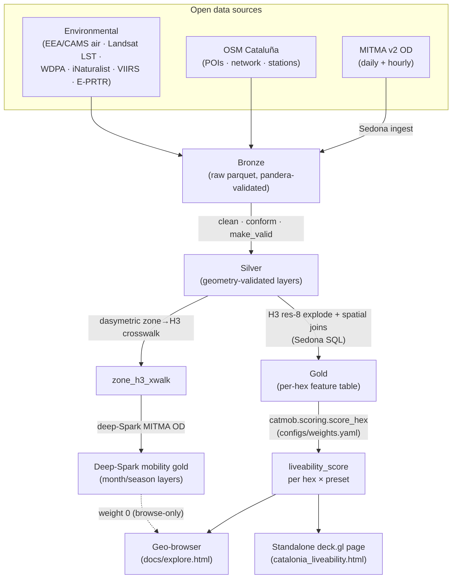

# mitma-sedona

[](docs/quickstart.md#tests)
[](#)
[](#)
[](#)
[](LICENSE)

[](docs/explore.html)

> **Where in Catalonia could I live well?** Within bike-reach of a train station that connects to Barcelona, with climbing gyms and yoga nearby, close to green or sea, away from heavy industry and motorway noise — and breathing clean air, away from urban heat and light pollution, near biodiversity, with health amenities at hand.

A multi-criteria **liveability index over Catalonia**, computed at H3 res-8
(~0.7 km² hexes) with **Apache Sedona on Spark** for the spatial-join heavy
lifting. A real personal question, answered with real data engineering — and a
portfolio piece that shows the operational shape of a geospatial scoring
pipeline under open-data constraints.

> **▶ [Explore the interactive geo-browser →](https://lunasilvestre.github.io/mitma-sedona/explore.html)** —
> a satellite-backed deck.gl map of the liveability index over Catalonia. Toggle
> the liveability output and any scoring-input metric, switch between scoring
> presets, and use the Month-window selector to re-point the season-aware
> mobility layers. Keyless and fully static (deck.gl + MapLibre + h3-js),
> served from GitHub Pages. Source:
> [`docs/explore.html`](docs/explore.html) +
> [`docs/app/geobrowser-map.js`](docs/app/geobrowser-map.js).

[](docs/flows.html)

> **▶ [Explore the mobility flows →](https://lunasilvestre.github.io/mitma-sedona/flows.html)** —
> a keyless deck.gl + Flowmap.gl origin–destination explorer over the same MITMA matrix:
> zoom-LOD clustering into super-nodes, an hour-of-day scrubber, Feb/May/Jun season
> slices, and typed picking on any flow or node. Source:
> [`docs/flows.html`](docs/flows.html) +
> [`docs/app/flows_fm/main.js`](docs/app/flows_fm/main.js).

## Why this exists

National "best places to live" rankings are coarse, opinion-weighted, and
city-level. This project answers a *personal* question at hex granularity:
**where could I, specifically, live well in Catalonia** — trading off mobility
to Barcelona, lifestyle amenities, nature, environmental health, and
penalties (industry, motorway noise, urban heat) — with every dimension sourced
from open data and every weight legible in five lines of YAML. The point is
auditability and honesty about coverage, not a glossy verdict.

## Pipeline

A Bronze → Silver → Gold lakehouse with H3 res-8 as the analytical grain and
Sedona for every spatial join. Full design:
[`docs/architecture.md`](docs/architecture.md) ·
[`docs/sedona_sql_patterns.md`](docs/sedona_sql_patterns.md).



A separate deep-Spark Sedona pass builds the MITMA mobility and month/season
layers; they carry weight 0, so they do not affect the published score. Method +
numbers: [`docs/why_spark_sedona.md`](docs/why_spark_sedona.md).

## The liveability score

A per-hex weighted sum across **6 dimensions**, computed at H3 res-8. It is a
**relative index** — a starting question, not a guarantee. NULL features (sparse
coverage) are kept as a distinct *"none within reach"* state, never silently
rendered as 0. Amenity terms are **saturating positive closeness rewards** — full
bonus on the doorstep, decaying to 0 at the catchment edge — so presence always
beats absence and near beats far. Every distance is computed in **EPSG:25831
metres**.

| Dimension | Sources |
|---|---|
| Mobility & accessibility | Train reach from stations, Renfe Rodalies + FGC GTFS frequency |
| Lifestyle | OSM `sport=climbing`, `sport=yoga` (closeness reward) |
| Mobility "vibe" | MITMA daily OD inflow / outflow, through-flow ratio |
| Penalties | OSM `landuse=industrial`, E-PRTR registry, motorway proximity |
| Health amenities | OSM hospitals ∪ CatSalut registry, OSM pharmacy density |
| Nature | OSM parks / coastline, Copernicus tree cover, Natura 2000, GBIF/iNaturalist biodiversity |
| Environmental health | XVPCA NO₂/PM₂.₅, Landsat LST urban-heat Δ, VIIRS light pollution |

Four presets re-weight the dimensions: `default`, `nature_first`,
`quiet_strict`, `amenity_first`. The scoring function is
`catmob.scoring.score_hex`, driven by
[`configs/weights.yaml`](configs/weights.yaml). Full methodology:
[`docs/scoring.md`](docs/scoring.md).

## Data sources

All open, all citable. Main families: MITMA OD, OSM, GTFS, and
air/thermal/biodiversity/light/industry layers. The score is built on a 7-day
2024 window; the mobility/season layers use a separate 2025 window. Full catalog,
licences, and data windows:
[`docs/data_sources.md`](docs/data_sources.md) ·
[`data/README.md`](data/README.md).

## Stack

| Concern | Choice |
|---|---|
| Spatial joins at scale | **Apache Sedona 1.9 on Spark 4.1** |
| Analytical grain | **H3 res-8** (~0.7 km² hexes) |
| Lakehouse | **Bronze → Silver → Gold** parquet, pandera contracts on write |
| Library | `src/catmob/` (schemas, io, scoring, viz) |
| Visualisation | **deck.gl 9.3 + MapLibre GL 4.7 + h3-js**, keyless, zero build |

## Quickstart

A tests-only path (no Docker) and the full Docker stack. Full recipe:
[`docs/quickstart.md`](docs/quickstart.md).

```bash
git clone git@github.com:lunasilvestre/mitma-sedona.git && cd mitma-sedona
python3 -m venv .venv && source .venv/bin/activate
pip install 'pandera[pandas]>=0.20' pytest pandas
PYTHONPATH=src pytest -q            # → 47 passed
xdg-open docs/preview_deck.html     # standalone deck.gl preview (no backend)
```

For the real Sedona/Spark pipeline:
`docker compose -f docker/docker-compose.yml up -d` (JupyterLab on :8888,
Valhalla on :8002).

## Deeper docs

| Doc | What's in it |
|---|---|
| [docs/quickstart.md](docs/quickstart.md) | Run it in 5 min (tests + preview) or 10 min (full Docker stack) |
| [docs/architecture.md](docs/architecture.md) | Repo layout + Bronze→Silver→Gold lakehouse + Sedona SQL idioms |
| [docs/why_spark_sedona.md](docs/why_spark_sedona.md) | Where Spark/Sedona earns its keep: the deep-Spark OD run, dasymetric crosswalk, and the month/season dimension |
| [docs/scoring.md](docs/scoring.md) | The liveability score: 6 dimensions, weights, and the four presets |
| [docs/data_sources.md](docs/data_sources.md) | Every upstream source + licence + the default data window |
| [docs/visualization.md](docs/visualization.md) | The deck.gl / Lonboard stack and the explore.html geo-browser |
| [docs/results.md](docs/results.md) | Gold artifacts, Top-10, score distribution, and what the index does and does not capture |
| [docs/sedona_sql_patterns.md](docs/sedona_sql_patterns.md) | 8 advanced Sedona SQL patterns (H3 explode, dasymetric, `RS_ZonalStats`, …) |
| [docs/v2_revision.md](docs/v2_revision.md) | How the index is constructed and why each dimension is defensible |
| [PLAN.md](PLAN.md) | Canonical planning doc covering scope, design decisions, and the build sequence |

## Attribution

- *Datos de movilidad: Ministerio de Transportes y Movilidad Sostenible (MITMS)*
- *© OpenStreetMap contributors, ODbL*
- *© European Environment Agency (EEA)*
- *Generated using Copernicus data and information funded by the European Union — Copernicus Climate Change Service / Atmosphere Monitoring Service*
- *iNaturalist (via GBIF) — CC BY-NC*
- *Generalitat de Catalunya — analisi.transparenciacatalunya.cat*

## Licence

[MIT](LICENSE) — code only. Each upstream dataset retains its own licence; see
the attribution block above and [docs/data_sources.md](docs/data_sources.md).

---

Built by [@lunasilvestre](https://github.com/lunasilvestre) with Claude Code.
