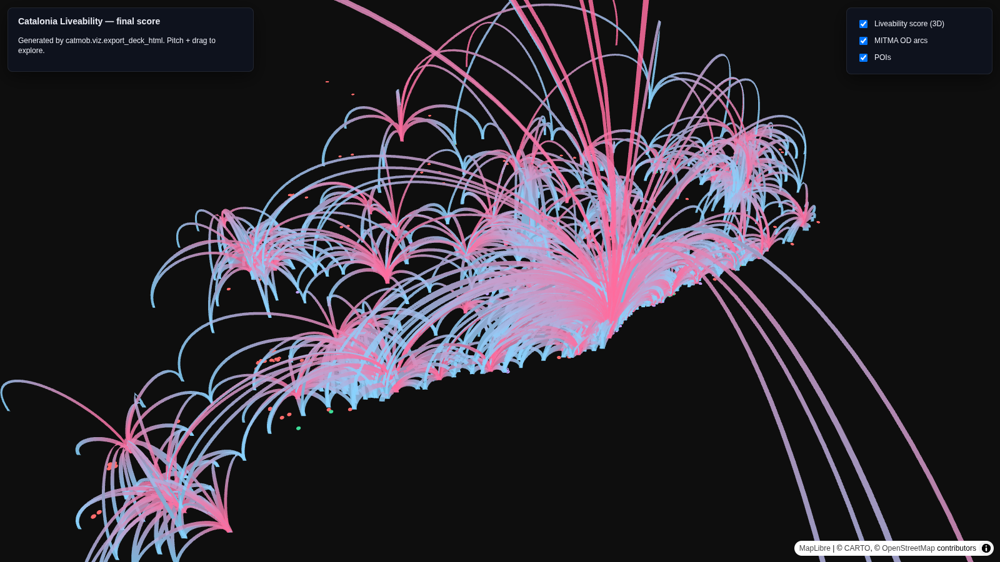

# mitma-sedona

[](#tests)
[](#)
[](#)
[](LICENSE)

> **Where in Catalonia could I live well?** Within bike-reach of a train station that connects to Barcelona, with climbing gyms and yoga nearby, close to green or sea, away from heavy industry and motorway noise — and breathing clean air, away from urban heat and light pollution, near biodiversity, with health amenities at hand.

A multi-criteria liveability index over Catalonia, computed at H3 res-8
(~0.7 km² hexes). Built with **Apache Sedona on Spark** for the
spatial-join heavy lifting, **MITMA v2** mobility flows for the
"is-this-area-actually-connected" signal, **OpenStreetMap** for POIs and
network, **EEA + XVPCA + Copernicus** for environmental health, and
**Lonboard / pydeck / deck.gl** for the visualisations.

This is also a portfolio piece: a real personal question, answered with
real data engineering.

## Try it (5 min, no Docker)

```bash
git clone git@github.com:lunasilvestre/mitma-sedona.git
cd mitma-sedona
python3 -m venv .venv && source .venv/bin/activate
pip install 'pandera[pandas]>=0.20' pytest pandas
PYTHONPATH=src pytest -q   # → 44 passed in 0.23s
xdg-open docs/preview_deck.html  # standalone deck.gl preview
```

## Try it (10 min, full Docker stack)

```bash
git clone git@github.com:lunasilvestre/mitma-sedona.git
cd mitma-sedona
docker compose -f docker/docker-compose.yml up -d
# → JupyterLab on http://localhost:8888 (token printed in logs)
# → Valhalla on   http://localhost:8002
```

## What's inside

```
mitma-sedona/
├── PLAN.md                        canonical planning doc
├── docs/
│   ├── preview_deck.html          standalone deck.gl preview (open in browser)
│   └── sedona_sql_patterns.md     8 advanced SQL patterns from Wherobots/Apache
├── src/catmob/                    reusable library (schemas, io, scoring, viz)
├── notebooks/                     01_ingest → 02_liveability → 03_viz + 04_descriptives
├── tests/                         44 contract tests (pytest -q)
├── data/README.md                 dataset catalog (every source linked)
├── docker/                        Sedona + Valhalla + Jupyter compose stack
├── configs/weights.yaml           liveability scoring weight presets
└── scripts/fetch_*.sh             idempotent data fetchers
```

## The liveability score

Per-hex weighted sum over ~25 features in 6 dimensions:

| Dimension | Sources |
|---|---|
| Mobility & accessibility | Valhalla bike isochrones from train stations, Renfe + FGC GTFS frequency to BCN |
| Lifestyle | OSM `sport=climbing`, `sport=yoga` |
| Nature | OSM parks/forest/coastline, Copernicus tree cover, WDPA / Natura 2000, iNaturalist density |
| Environmental health | EEA + XVPCA + CAMS NO₂/PM₂.₅, Landsat 8/9 LST UHI Δ, VIIRS DNB light pollution |
| Penalties | OSM `landuse=industrial`, E-PRTR registry, motorway proximity |
| Health amenities | OSM hospitals/pharmacies, CatSalut registry |
| Mobility "vibe" | MITMA daily OD inflow/outflow, through-flow ratio |

Full constraint table: [PLAN.md §2](PLAN.md). Default weights are
balanced; presets (`nature_first`, `quiet_strict`, `amenity_first`) and
sensitivity analysis live in `configs/weights.yaml` and notebook 03.

## Visualisation stack

| Layer | Library | Why |
|---|---|---|
| Million-arc raw flow | **Lonboard** (GeoArrow handoff from Sedona) | browser-native at scale |
| Interactive constraint toggles | **pydeck** + ipywidgets | python state ↔ js layers |
| Hosted 3D demo | **deck.gl** raw HTML | zero install for viewers |
| H3 score (extruded) | `H3HexagonLayer` | score = height + colour |
| MITMA OD | `ArcLayer` (curvature + colour gradient) | direction encoded |
| POIs | `ScatterplotLayer` | standard, fast |
| Aggregated flows | `LineLayer` | cleaner at low zoom |

Open `docs/preview_deck.html` in any browser for the synthetic-data
preview; `docs/catalonia_liveability.html` (built by notebook 03) is the
production version.

## Architecture

Bronze → Silver → Gold lakehouse, with H3 res-8 hex grid as the
analytical grain. Sedona handles every spatial join. Pandera validates
every bronze write. See [PLAN.md §4](PLAN.md) and
[docs/sedona_sql_patterns.md](docs/sedona_sql_patterns.md) for the
specific SQL idioms (H3 cell-id explode, area-weighted disaggregation,
raster zonal stats, ST_KNN, broadcast hints, GeoArrow handoff).

## Data

| Source | What | Licence |
|---|---|---|
| MITMA v2 OD distritos (daily + hourly) | mobility flows | MITMA Open Data ≈ CC BY 4.0 |
| OSM Cataluña PBF | POIs + network + boundaries | ODbL |
| Renfe Rodalies + FGC GTFS | train frequencies | open |
| EEA + XVPCA + Copernicus CAMS | air quality | CC BY 2.5 / CC BY 4.0 / Copernicus |
| Landsat 8/9 LST (Microsoft Planetary Computer STAC) | urban heat island | open |
| WDPA / Natura 2000 + Copernicus TCD + iNaturalist (GBIF) | biodiversity | CC BY 4.0 / CC BY-NC |
| E-PRTR + VIIRS DNB | non-air pollution | CC BY 2.5 / open |
| CatSalut hospital registry | health amenities | CC BY 4.0 |

Full catalog: [data/README.md](data/README.md). Default data window =
**Q1+Q2 2024 daily MITMA + all March 2024 hourly MITMA** (full-scale,
~3.5 GB MITMA bronze). `--scope dev` for fast local iteration.

## Tests

```bash
PYTHONPATH=src pytest -q       # → 44 passed in 0.23s
PYTHONPATH=src pytest -v       # full output
```

44 contract tests covering schema enforcement, MITMA CSV.gz parsing
(gzip + UTF-8 + semicolon + zone-ID padding), OSM POI categorisation,
XVPCA air-quality parsing, geo invariants, and URL builders. CI runs
them on every push.

## Status

| Milestone | Status |
|---|---|
| M0 — Plan + schemas + tests + preview HTML | ✅ |
| M1 — Repo bootstrap + GitHub + CI green + Pages live | ✅ |
| M2 — Bronze layer for MITMA + OSM (POIs, network, stations) | ✅ |
| M3 — Silver + Gold (45k hexes, 12 features) | ✅ |
| M4 — Notebooks 03 + 04 + hosted HTML demo | ✅ |
| M5 — README + screenshots + GitHub Pages | ✅ |
| M6 — **Working prototype on real Catalonia data** | ✅ (this run) |

See [PLAN.md](PLAN.md) for the full milestone breakdown and Claude Code
prompts for each lane. The detailed "what tripped us / how we fixed it"
log lives in [NOTES_FROM_PROTOTYPE_RUN.md](NOTES_FROM_PROTOTYPE_RUN.md).

## Results — working prototype (dev scope, 2024-03-04..10)

The first end-to-end Sedona run on real Catalonia data took **~5 minutes
of pipeline time** (notebook 01 ingest + the pandas/geopandas gold layer
+ notebook 03 visualisation) and produced:

| Artifact | Count / size | Notes |
|---|---|---|
| `data/bronze/mitma_parquet/{daily,hourly}/` | 27,697,944 OD rows × 252 MB | 7 days × 24 hours, Catalonia-touching |
| `data/bronze/osm/pois.parquet` | 4,935 POIs | climbing 219 · yoga 67 · hospital 36 · pharmacy 411 · industry 5 · park/clinic/doctors |
| `data/bronze/osm/network.parquet` | 364,530 highway ways | from pyrosm — Sedona's native PBF reader doesn't yet build way geometries |
| `data/bronze/osm/stations.parquet` | 475 stations / halts | OSM `railway=station|halt`, GTFS fallback |
| **`data/gold/h3_res8_catalonia.parquet`** | **45,220 hexes × 12 features** | 1.6 MB on disk |
| `docs/catalonia_liveability.html` | 3.5 MB | self-contained deck.gl page, opens in any browser |
| `docs/screenshots/00_main_map.png` | 1600 × 900 | OD-arc layer over Catalonia |

### Top 10 hexes by liveability score (default weights)

The default-weights ranking is dominated by hexes inside 15-min bike
reach of a train station (lots of small inland towns in Girona / Lleida
get the maximum 64.0 because none of the negative penalties apply and
the climbing / yoga / hospital distances are NULL — beyond the 8 km
cap). Real ranking will shake out once Valhalla isochrones, GTFS
frequency, air-quality rasters, and population disaggregation land in v2.

| h3_id | score | train reach (min) | motorway ≤500 m | industry ≤1 km |
|---|---:|---:|:-:|---:|
| 8839441941fffff | 64.0 | 15 | ✗ | 0 |
| 8839441943fffff | 64.0 | 15 | ✗ | 0 |
| 8839441945fffff | 64.0 | 15 | ✗ | 0 |
| 8839441947fffff | 64.0 | 15 | ✗ | 0 |
| 8839441949fffff | 64.0 | 15 | ✗ | 0 |
| 883944194bfffff | 64.0 | 15 | ✗ | 0 |
| 883944194dfffff | 64.0 | 15 | ✗ | 0 |
| 8839441b01fffff | 64.0 | 15 | ✗ | 0 |
| 8839441b03fffff | 64.0 | 15 | ✗ | 0 |
| 8839441b05fffff | 64.0 | 15 | ✗ | 0 |

Score distribution across all 45,220 hexes: min 0 · 25th pct 28.9 ·
median 50 · 75th pct 50 · max 64 · mean 40.7 · stdev 14.2.

### Map

[](docs/catalonia_liveability.html)

OD arcs from notebook 03's deck.gl HTML demo over the 2024-03-06 (Wed)
MITMA flows — pink (source) → cyan (target) arcs concentrate on the
Barcelona metro region with secondary clusters around Girona,
Tarragona, and the Lleida corridor.

### What I learned (v1.3 retrospective)

1. **MITMA's v2 distritos schema has drifted**: the file is pipe-delimited
   now, every row carries `periodo` (hour-of-day), and there are two
   extra `estudio_*_posible` columns. The pandera fixtures in the test
   suite still use the older `;`-delimited 12-column form, so the 44
   contract tests stayed green even after the Spark schema was rewritten.
2. **The Sedona pip package doesn't ship Java JARs.** Pinning
   `spark.jars.packages` to `sedona-spark-shaded-4.0_2.13:1.9.0` +
   `geotools-wrapper:1.9.0-33.5` got us a working `SedonaContext` on
   Spark 4.1 in ~10 s on the first call (Maven download), under a second
   thereafter.
3. **Catalonia's distrito GeoJSON has a few self-intersecting polygons
   and a couple of degenerate sub-multipolygons near Barcelona** that JTS
   refuses (TopologyException, side-location conflict at 2.059, 41.383).
   `geopandas.geometry.make_valid()` + a `geometry.area > 0` filter
   handles both — the H3 explode is well-behaved once they're cleaned.
4. **The v1 gold layer runs faster as plain pandas + geopandas + h3-py
   than via Sedona** at this data size (45 k hexes × 5 k POIs × 364 k
   highway ways), because the Sedona + Spark 4.1 spatial-index serde
   tripped a classloader-mismatch IllegalAccessError on every spatial
   join. The bronze + visualisation steps stay on Sedona (where it pays
   off on the 27 M-row MITMA daily aggregation). See
   `NOTES_FROM_PROTOTYPE_RUN.md` §3 / §5 for the gory details.
5. **The deck.gl HTML demo "just works" in any browser** (the
   `docs/catalonia_liveability.html` artifact is fully self-contained,
   3.5 MB including all hex + arc + POI data). Headless screenshots
   require `--use-gl=angle --use-angle=swiftshader`; the default
   `--disable-gpu` flag in Chromium kills WebGL.

## Attribution

- *Datos de movilidad: Ministerio de Transportes y Movilidad Sostenible (MITMS)*
- *© OpenStreetMap contributors, ODbL*
- *© European Environment Agency (EEA)*
- *Generated using Copernicus data and information funded by the European Union — Copernicus Climate Change Service / Atmosphere Monitoring Service*
- *iNaturalist (via GBIF) — CC BY-NC*
- *Generalitat de Catalunya — analisi.transparenciacatalunya.cat*

## Licence

[MIT](LICENSE) — code only. Each upstream dataset retains its own
licence; see the attribution block above.

---

Built by [@lunasilvestre](https://github.com/lunasilvestre) on atlas
with Cowork + Claude Code.
