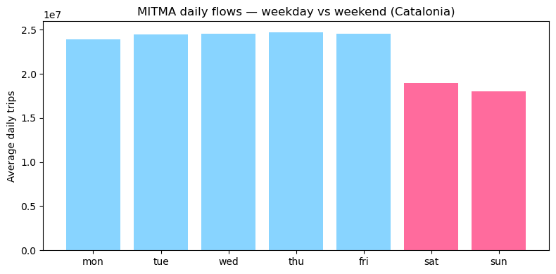
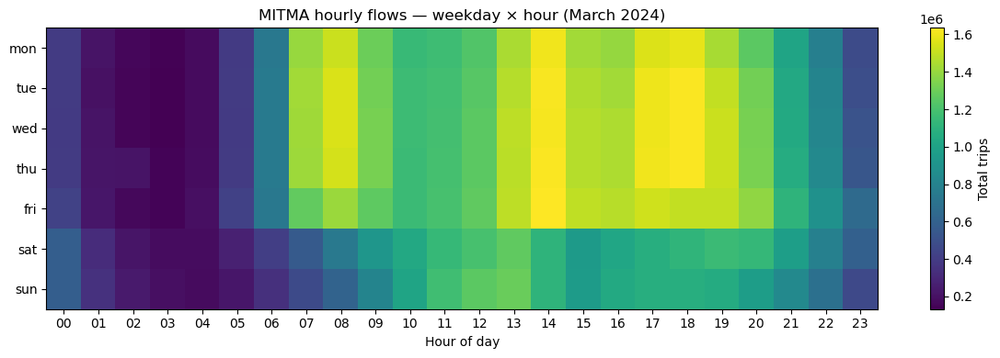
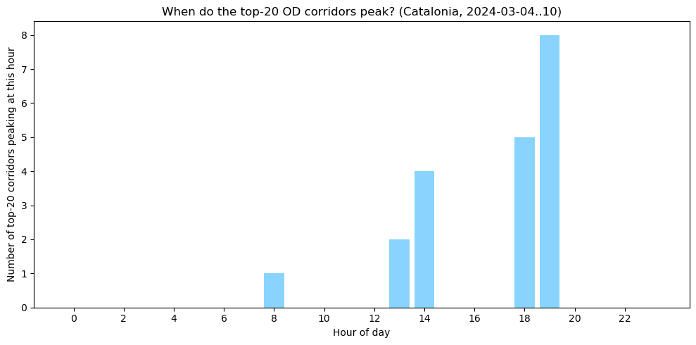
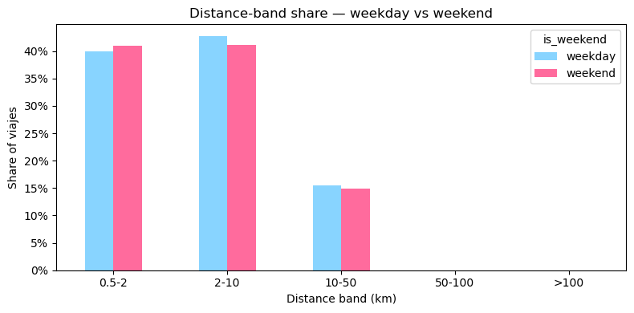
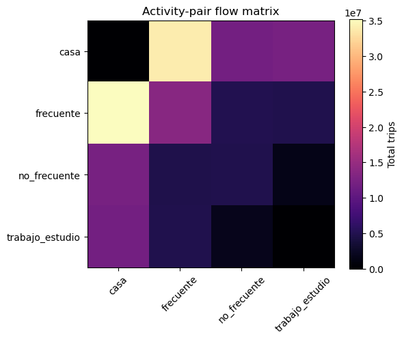
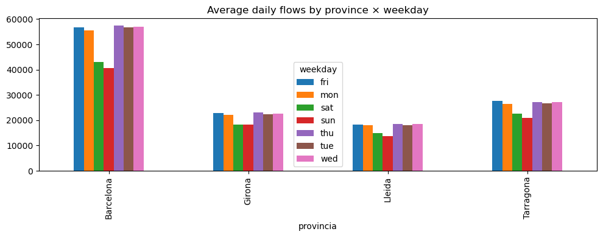
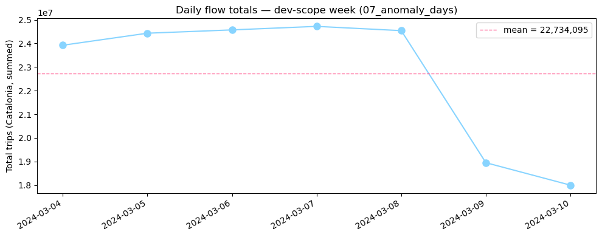
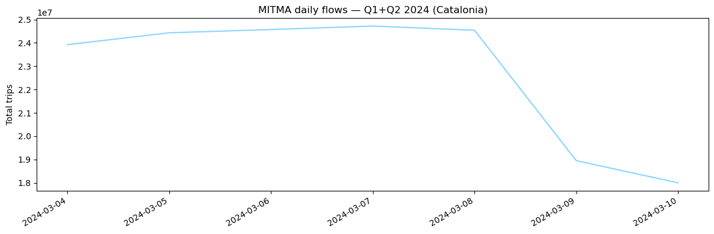

# 04 — Descriptive statistics & charts

Justifies the firepower of `--scope full`. Without 6 months of daily +
1 month of hourly data, none of these charts are interesting.

**8 publication-quality charts** saved to `docs/screenshots/`:

1. Weekday vs weekend daily-flow bar chart (per province + Catalonia total)
2. Per-weekday hourly profile heatmap
3. Rush-hour identification — top-20 BCN-bound corridors
4. Distance-band shifts by weekday
5. Activity-pair matrix (`casa→trabajo_estudio` etc.)
6. Per-province comparison
7. Anomaly day surface (Easter / Spring break)
8. Seasonality across Q1+Q2 2024


```python
import os
import sys
from pathlib import Path

_here = Path.cwd()
if (_here / "PLAN.md").exists():
    REPO = _here
elif (_here.parent / "PLAN.md").exists():
    REPO = _here.parent
elif Path("/workspace/PLAN.md").exists():
    REPO = Path("/workspace")
else:
    REPO = Path("/home/nls/Documents/dev/mitma-sedona")
sys.path.insert(0, str(REPO / "src"))

# Cached Sedona JARs on the app classloader (see notebook 02 for rationale).
_IVY = Path.home() / ".ivy2.5.2/cache"
SEDONA_JAR   = _IVY / "org.apache.sedona/sedona-spark-shaded-4.0_2.13/jars/sedona-spark-shaded-4.0_2.13-1.9.0.jar"
GEOTOOLS_JAR = _IVY / "org.datasyslab/geotools-wrapper/jars/geotools-wrapper-1.9.0-33.5.jar"
os.environ["PYSPARK_SUBMIT_ARGS"] = f"--jars {SEDONA_JAR},{GEOTOOLS_JAR} pyspark-shell"

import altair as alt
import matplotlib.pyplot as plt
import pandas as pd
from catmob import stats
from sedona.spark import SedonaContext

config = (
    SedonaContext.builder()
        .appName("mitma-sedona-04-stats")
        .config("spark.sql.shuffle.partitions", "8")
        .config("spark.driver.memory", "6g")
        .config("sedona.global.index", "false")
        .config("sedona.join.optimizationmode", "none")
        .getOrCreate()
)
sedona = SedonaContext.create(config)
sedona.sparkContext.setLogLevel("ERROR")

SCREENSHOT_DIR = REPO / "docs/screenshots"
SCREENSHOT_DIR.mkdir(parents=True, exist_ok=True)
```

    WARNING: Using incubator modules: jdk.incubator.vector


    Warning: Ignoring non-Spark config property: sedona.global.index
    Warning: Ignoring non-Spark config property: sedona.join.optimizationmode
    Using Spark's default log4j profile: org/apache/spark/log4j2-defaults.properties
    26/05/15 00:18:11 WARN Utils: Your hostname, atlas, resolves to a loopback address: 127.0.1.1; using 192.168.8.101 instead (on interface enp42s0)
    26/05/15 00:18:11 WARN Utils: Set SPARK_LOCAL_IP if you need to bind to another address


    26/05/15 00:18:11 WARN NativeCodeLoader: Unable to load native-hadoop library for your platform... using builtin-java classes where applicable
    Using Spark's default log4j profile: org/apache/spark/log4j2-defaults.properties
    Setting default log level to "WARN".
    To adjust logging level use sc.setLogLevel(newLevel). For SparkR, use setLogLevel(newLevel).


    26/05/15 00:18:15 WARN Catalog: GEO stats functions are not available due to Spark/DBR compatibility issues.
    java.lang.NoClassDefFoundError: org/apache/spark/sql/catalyst/expressions/FoldableUnevaluable
    	at java.base/java.lang.Class.getDeclaredConstructors0(Native Method)
    	at java.base/java.lang.Class.privateGetDeclaredConstructors(Class.java:3551)
    	at java.base/java.lang.Class.getConstructor0(Class.java:3756)
    	at java.base/java.lang.Class.getConstructor(Class.java:2444)
    	at org.apache.sedona.sql.UDF.AbstractCatalog.function(AbstractCatalog.scala:42)
    	at org.apache.sedona.sql.UDF.Catalog$.geoStatsFunctions(Catalog.scala:384)
    	at org.apache.sedona.sql.UDF.Catalog$.<clinit>(Catalog.scala:373)
    	at org.apache.sedona.spark.SedonaContext$.create(SedonaContext.scala:132)
    	at org.apache.sedona.spark.SedonaContext.create(SedonaContext.scala)
    	at java.base/jdk.internal.reflect.NativeMethodAccessorImpl.invoke0(Native Method)
    	at java.base/jdk.internal.reflect.NativeMethodAccessorImpl.invoke(NativeMethodAccessorImpl.java:75)
    	at java.base/jdk.internal.reflect.DelegatingMethodAccessorImpl.invoke(DelegatingMethodAccessorImpl.java:52)
    	at java.base/java.lang.reflect.Method.invoke(Method.java:580)
    	at py4j.reflection.MethodInvoker.invoke(MethodInvoker.java:244)
    	at py4j.reflection.ReflectionEngine.invoke(ReflectionEngine.java:374)
    	at py4j.Gateway.invoke(Gateway.java:282)
    	at py4j.commands.AbstractCommand.invokeMethod(AbstractCommand.java:132)
    	at py4j.commands.CallCommand.execute(CallCommand.java:79)
    	at py4j.ClientServerConnection.waitForCommands(ClientServerConnection.java:184)
    	at py4j.ClientServerConnection.run(ClientServerConnection.java:108)
    	at java.base/java.lang.Thread.run(Thread.java:1583)
    Caused by: java.lang.ClassNotFoundException: org.apache.spark.sql.catalyst.expressions.FoldableUnevaluable
    	at java.base/java.net.URLClassLoader.findClass(URLClassLoader.java:445)
    	at java.base/java.lang.ClassLoader.loadClass(ClassLoader.java:593)
    	at java.base/java.lang.ClassLoader.loadClass(ClassLoader.java:526)
    	... 21 more
    26/05/15 00:18:15 WARN SimpleFunctionRegistry: The function st_geogfromwkb replaced a previously registered function.
    26/05/15 00:18:15 WARN SimpleFunctionRegistry: The function st_geogfromwkb replaced a previously registered function.
    26/05/15 00:18:15 WARN SimpleFunctionRegistry: The function st_geomfromwkb replaced a previously registered function.
    26/05/15 00:18:15 WARN SimpleFunctionRegistry: The function st_geomfromwkb replaced a previously registered function.
    26/05/15 00:18:15 WARN SimpleFunctionRegistry: The function st_asbinary replaced a previously registered function.
    26/05/15 00:18:15 WARN SimpleFunctionRegistry: The function st_asbinary replaced a previously registered function.
    26/05/15 00:18:15 WARN SimpleFunctionRegistry: The function st_srid replaced a previously registered function.
    26/05/15 00:18:15 WARN SimpleFunctionRegistry: The function st_srid replaced a previously registered function.
    26/05/15 00:18:15 WARN SimpleFunctionRegistry: The function st_setsrid replaced a previously registered function.
    26/05/15 00:18:15 WARN SimpleFunctionRegistry: The function st_setsrid replaced a previously registered function.


## 1. Aggregate to pandas


```python
daily_total = (
    sedona.read.parquet(str(REPO / "data/bronze/mitma_parquet/daily"))
        .groupBy("fecha", "origen")
        .sum("viajes")
        .withColumnRenamed("sum(viajes)", "viajes")
        .toPandas()
)
daily_total["provincia"] = daily_total["origen"].str[:2]
daily_total = stats.add_weekday(daily_total)
print(f"Daily aggregate rows: {len(daily_total):,}")

hourly_total = (
    sedona.read.parquet(str(REPO / "data/bronze/mitma_parquet/hourly"))
        .groupBy("fecha", "periodo", "origen", "destino", "distancia",
                 "actividad_origen", "actividad_destino")
        .sum("viajes")
        .withColumnRenamed("sum(viajes)", "viajes")
        .toPandas()
)
# v2 `periodo` is a zero-padded string like "00".."23"; cast to int so the
# heatmap axis sorts numerically.
hourly_total["periodo"] = hourly_total["periodo"].astype(int)
hourly_total = stats.add_weekday(hourly_total)
print(f"Hourly aggregate rows: {len(hourly_total):,}")
```

    
[Stage 4:============================================>            (25 + 7) / 32]

    
                                                                                

    Daily aggregate rows: 18,420


    
[Stage 8:============================================>            (25 + 7) / 32]

    
[Stage 8:==============================================>          (26 + 6) / 32]

    
[Stage 8:================================================>        (27 + 5) / 32]

    
[Stage 8:===================================================>     (29 + 3) / 32]

[Stage 8:=======================================================> (31 + 1) / 32]

    
[Stage 10:>                                                         (0 + 8) / 8]

    
[Stage 10:=====================>                                    (3 + 5) / 8]

[Stage 10:===========================================>              (6 + 2) / 8]

    
                                                                                

    Hourly aggregate rows: 16,591,625


## 2. Chart 1 — Weekday vs weekend


```python
wkd = stats.daily_totals_by_weekday(daily_total)
fig, ax = plt.subplots(figsize=(8, 4))
colors = ["#88d4ff"]*5 + ["#ff6b9d"]*2
ax.bar(wkd["weekday"], wkd["viajes"], color=colors)
ax.set_title("MITMA daily flows — weekday vs weekend (Catalonia)")
ax.set_ylabel("Average daily trips")
fig.tight_layout()
fig.savefig(SCREENSHOT_DIR / "01_weekday_vs_weekend.png", dpi=150)
plt.show()
```


    

    


## 3. Chart 2 — Per-weekday hourly profile (heatmap)


```python
heat = stats.hourly_profile(hourly_total)
fig, ax = plt.subplots(figsize=(12, 4))
im = ax.imshow(heat.values, aspect="auto", cmap="viridis")
ax.set_yticks(range(7), heat.index)
ax.set_xticks(range(24), [f"{h:02d}" for h in range(24)])
ax.set_xlabel("Hour of day")
ax.set_title("MITMA hourly flows — weekday × hour (March 2024)")
fig.colorbar(im, label="Total trips")
fig.tight_layout()
fig.savefig(SCREENSHOT_DIR / "02_hourly_heatmap.png", dpi=150)
plt.show()
```


    

    


## 4. Chart 3 — Rush-hour identification (top-20 corridors)


```python
peaks = stats.peak_hour_per_corridor(hourly_total, n=20)
print(peaks.to_string(index=False))

fig, ax = plt.subplots(figsize=(10, 5))
peak_counts = peaks.groupby("peak_hour").size().reindex(range(24), fill_value=0)
ax.bar(peak_counts.index, peak_counts.values, color="#88d4ff")
ax.set_xticks(range(0, 24, 2))
ax.set_xlabel("Hour of day")
ax.set_ylabel("Number of top-20 corridors peaking at this hour")
ax.set_title("When do the top-20 OD corridors peak? (Catalonia, 2024-03-04..10)")
fig.tight_layout()
fig.savefig(SCREENSHOT_DIR / "03_peak_hour_corridors.png", dpi=150)
plt.show()
```

     origen destino      viajes  peak_hour
    0801910 0801910 2086935.482         18
    0801902 0801902 2013514.214         19
    0801903 0801903 1187267.999         13
    0801907 0801907 1177978.005         19
    0801905 0801905 1170494.838         14
    0801909 0801909  890995.214         19
    0801908 0801908  847109.125         19
      08298   08298  735890.439         14
    0801901 0801901  686016.129         14
    0801902 0801901  579971.446         19
    0801906 0801906  578996.635         19
    0801901 0801902  573298.882         18
    0801904 0801904  562919.295         14
    0801910 0801902  541604.899         18
    0801902 0801910  541491.672         18
      08102   08102  510267.708         13
    0801902 0801903  491367.278         19
    0801903 0801902  485127.780          8
    0801909 0801908  451664.805         19
    0801908 0801909  446396.292         18


    

    


## 5. Chart 4 — Distance-band shifts by weekday


```python
band = stats.distance_band_share(hourly_total)
band_pivot = (
    band.pivot(index="distancia", columns="is_weekend", values="share")
        .reindex(["0.5-2", "2-10", "10-50", "50-100", ">100"])
        .rename(columns={False: "weekday", True: "weekend"})
        .fillna(0)
)
fig, ax = plt.subplots(figsize=(8, 4))
band_pivot.plot(kind="bar", ax=ax, color=["#88d4ff", "#ff6b9d"])
ax.set_title("Distance-band share — weekday vs weekend")
ax.set_ylabel("Share of viajes")
ax.set_xlabel("Distance band (km)")
ax.yaxis.set_major_formatter(plt.FuncFormatter(lambda x, _: f"{x:.0%}"))
plt.xticks(rotation=0)
fig.tight_layout()
fig.savefig(SCREENSHOT_DIR / "04_distance_band.png", dpi=150)
plt.show()
```


    

    


## 6. Chart 5 — Activity-pair matrix


```python
act_matrix = (
    hourly_total.groupby(["actividad_origen", "actividad_destino"])["viajes"]
        .sum().unstack().fillna(0)
)
fig, ax = plt.subplots(figsize=(6, 5))
im = ax.imshow(act_matrix.values, cmap="magma")
ax.set_xticks(range(len(act_matrix.columns)), act_matrix.columns, rotation=45)
ax.set_yticks(range(len(act_matrix.index)), act_matrix.index)
ax.set_title("Activity-pair flow matrix")
fig.colorbar(im, label="Total trips")
fig.tight_layout()
fig.savefig(SCREENSHOT_DIR / "05_activity_matrix.png", dpi=150)
plt.show()
```


    

    


## 7. Chart 6 — Per-province comparison


```python
prov = (
    daily_total.groupby(["provincia", "weekday"])["viajes"].mean().unstack()
        .reindex(["08", "17", "25", "43"])
        .rename(index={"08":"Barcelona","17":"Girona","25":"Lleida","43":"Tarragona"})
)
prov.plot(kind="bar", figsize=(10, 4), title="Average daily flows by province × weekday")
plt.tight_layout()
plt.savefig(SCREENSHOT_DIR / "06_per_province.png", dpi=150)
plt.show()
```


    

    


## 8. Chart 7 — Daily totals + anomaly markers (3σ)


```python
anom = stats.anomaly_days(daily_total)
print("Anomaly days (3σ from mean):")
print(anom)

# Daily totals across the dev-scope week, with anomaly flags. With only
# 7 days of data we don't expect 3σ outliers — this chart re-runs cleanly
# on full-scale where Spring break and Easter pop out.
daily_line = (
    daily_total.groupby("fecha")["viajes"].sum().reset_index()
        .assign(date=lambda d: pd.to_datetime(d["fecha"], format="%Y%m%d"))
        .sort_values("date")
)
mu = daily_line["viajes"].mean()
fig, ax = plt.subplots(figsize=(10, 4))
ax.plot(daily_line["date"], daily_line["viajes"], "o-", color="#88d4ff",
        linewidth=1.5, markersize=8)
ax.axhline(mu, color="#ff6b9d", linestyle="--", linewidth=1, label=f"mean = {mu:,.0f}")
if not anom.empty:
    anom_dates = pd.to_datetime(anom["fecha"], format="%Y%m%d")
    ax.scatter(anom_dates, anom["viajes"], color="red", s=120, zorder=5, label="3σ anomaly")
ax.set_ylabel("Total trips (Catalonia, summed)")
ax.set_title("Daily flow totals — dev-scope week (07_anomaly_days)")
ax.legend()
fig.autofmt_xdate()
fig.tight_layout()
fig.savefig(SCREENSHOT_DIR / "07_anomaly_days.png", dpi=150)
plt.show()
```

    Anomaly days (3σ from mean):
    Empty DataFrame
    Columns: [fecha, viajes, z_score]
    Index: []


    

    


## 9. Chart 8 — Seasonality across Q1+Q2 2024


```python
seasonal = (
    daily_total.groupby(["fecha"])["viajes"].sum().reset_index()
        .assign(date=lambda d: pd.to_datetime(d["fecha"], format="%Y%m%d"))
        .sort_values("date")
)
fig, ax = plt.subplots(figsize=(12, 4))
ax.plot(seasonal["date"], seasonal["viajes"], color="#88d4ff", linewidth=1.5)
ax.set_title("MITMA daily flows — Q1+Q2 2024 (Catalonia)")
ax.set_ylabel("Total trips")
fig.autofmt_xdate()
fig.tight_layout()
fig.savefig(SCREENSHOT_DIR / "08_seasonality.png", dpi=150)
plt.show()
```


    

    

